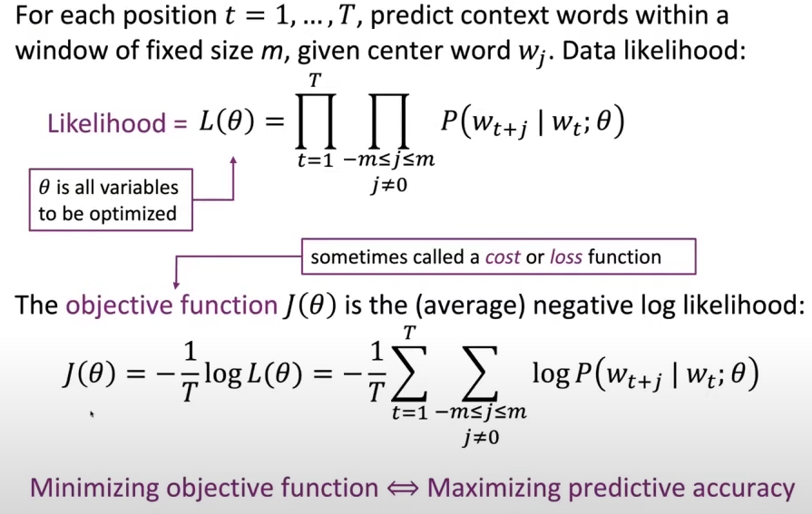
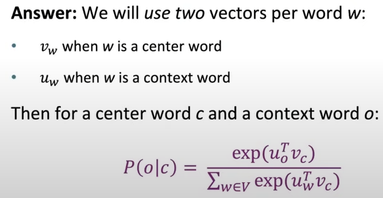
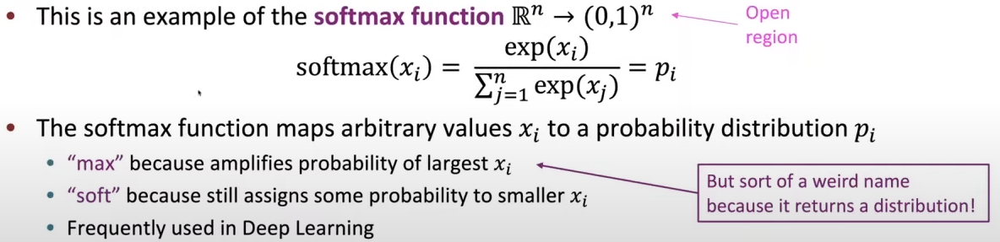

# Class 1
### General

  &emsp;&emsp;Human language is adapted for humans but difficult for computer to understand.
  Language is not a system but full of chaos. All words may have different meanings for different people.  
  &emsp;&emsp;Key problem is to let computer learn the information contained in human language.  
  &emsp;&emsp;GPT-3 might be a trial of universal model.
  It contains knowledge of human language and how to solve problems.
  With GPT, we don't need to make seperated supervise and classify for different tasks.
  Working as predicting the next word, GPT trys to understand.

### How to represent the meaning of a word?

* **Denotational Semantics**<!-- 指称语义 -->  
  &emsp;&emsp;Meaning can be signifier<!-- 能指事物 --> or signified<!-- 所指事物 -->.
  When we're talking about something, the signifier is the word we heard or the symbol we saw,
  and the signified is the thought appeared in our mind.  
  &emsp;&emsp;Traditionally, `word-net`, which contains `synonyms`<!-- 同义词 --> and `hypernyms`<!-- 上位词 -->
  (_is a_ relationship), is used in NLP. Word-net is great as a resource, but it misses nuance. 
  It also misses new meanings of words, where impossible to keep up-to-date. 
  It will miss similar words like fantastic and great, they have similar meanings, but are not synonyms.

* **Discrete Symbols(One-hot Vectors)**<!-- 离散单词 -->  
  &emsp;&emsp;Single words can be represented as one-hot vectors.  
  ```python
  motel = [0, 0, 0, 1, 0, 0]
  hotel = [0, 0, 1, 0, 0, 0]
  ```
  &emsp;&emsp;***Disadvantages***  
  &emsp;&emsp;1. One-hot vectors may have huge dimensions (e.g. a vocabulary with 500000 words).  
  &emsp;&emsp;2. Different vectors are orthogonal, and there is no nature notion of similarity for them.

* **Distributional Semantics**  
  <!-- 类似英语阅读题，根据上下文分析某个单词的意思 -->
  * **Definition:** A word's meaning is given by the words that _frequently_ appear close-by.  
  
  &emsp;&emsp;Use the many contexts of the _word_ to build a representation of it.
  `Context` is the set of words that appear nearby (in a fixed window).  
  &emsp;&emsp;Context semantic has computational meanings and had been successfully applied in deep learning.
  ```python
  banking = [0.286, 0.792, -0.177, ...]
  ```
  &emsp;&emsp;Usually a vector contains 300 dimensions. The meaning of word spreads on all the dimensions.

  * **Word Embeddings**
  
  &emsp;&emsp;The word is represented by dense vector and the vectors are similar that appear in similar contexts.
  This representation is called `word vectors`, or `word embeddings`, or `neural word representations`.  
  &emsp;&emsp;All vectors are embedded into high dimensional vector space and usually a two-dimensional projection of
  that space is used for human to understand the space easily. During the progress of projection, almost all information
  will be lost.  
  &emsp;&emsp;E.g. By projecting to two-dimensional, the words can be simply grouped by its meanings. Similar words may
  be close in the space.  
    
  
### Word2vec

  &emsp;&emsp;Every word in a fixed vocabulary is represented by a vector(distributional similarity). Go through each
  position _t_ in the text, which has a center word _c_ and context words _o_. Use the _similarity_ of the word vectors
  for _c_ and _o_ to calculate the _probability_ of _o_ with given _c_. Keep adjusting the word vectors to maximize
  this probability.  
  &emsp;&emsp;E.g. Computing _P_ in the context window.  
  
  
  * **How to calculate the probability of a word occurring in the context of the center word**  
  

  * **How to calculate _P_ in _J(θ)_**  
    
  _u<sup>T</sup><sub>o</sub> · v<sub>c</sub>_ means dot product of the two vectors. The bigger the dot product of two
  words is, the more similar they are. The `exp function` is used to avoid negative probability. The sum is used to
  normalize the probability to give the probability distribution.  
    
  The `softmax function` takes a set of number and returns the probability distribution.