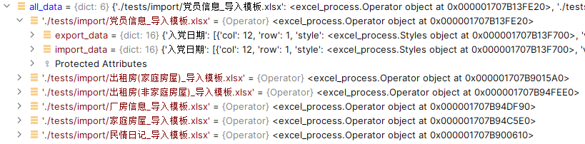

# Quick start

Learn lib `openpyxl`

* https://zhuanlan.zhihu.com/p/342422919
* https://www.jianshu.com/p/642456aa93e2
* https://openpyxl.readthedocs.io/en/stable

## Problems

1. No code completion for lib `openpyxl` in PyCharm

* Windows:    Delete ```C:\Program Files\JetBrains\PyCharm 2022.1.3\plugins\python\helpers\typeshed\stubs\openpyxl```
* MacOS:      ```rm -r /Applications/PyCharm.app/Contents/plugins/python/helpers/typeshed/stubs/openpyxl```

## Key Variable

1. all_data  
   
2. checked problem styles
   ```python
   from openpyxl.styles import PatternFill
   # style_date_problem
   date_fill = PatternFill('solid', fgColor='FFFF00')
   # style_dict_problem
   dict_fill = PatternFill('solid', fgColor='B0E0E6')
   # style_miss_problem  
   miss_fill = PatternFill('solid', fgColor='00FF00')
   # style_type_problem  
   type_fill = PatternFill('solid', fgColor='A020F0')
   # style_uniq_problem
   uniq_fill = PatternFill('solid', fgColor='00FFFF')
   # style_leng_problem
   leng_fill = PatternFill('solid', fgColor='0000FF')
   # style_mult_problem  
   mult_fill = PatternFill('solid', fgColor='FF0000')
   # style_error
   error_fill = PatternFill('solid', fgColor='F0FFF0')
   ```

## File Flow
1. import and export
```python
class Operator:
    def __init__(self):
        # raw import data
        self.import_data = {}
        # changes must in export_data
        self.export_data = {}

    def import_excel(self, path: str) -> {'': [{}]}:
        # imported data will be saved to both variables 
        # one for store another for process 
        pass

    def export_excel(self, title='sheet 0', filename='new excel.xlsx'):
        # just to export self.export_data
        pass
```

## Additions
（1）通用性（14个）：  
字典项、必填、日期、手机号、身份证、唯一性  
（2）关联数据（8个）：  
组织->户籍人口->家庭房屋->出租房（家庭房屋)  
出租房（家庭房屋)->出租房(非家庭房屋)  
出租房->新市民  
家庭->土地  
户籍人口、组织->民情日记  
